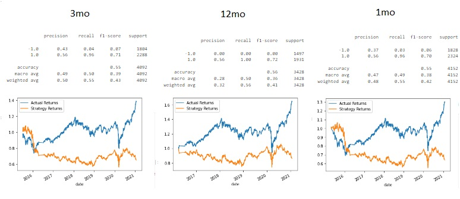
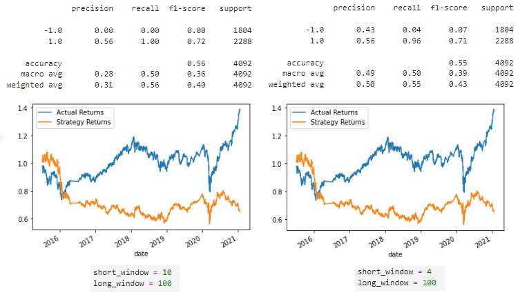
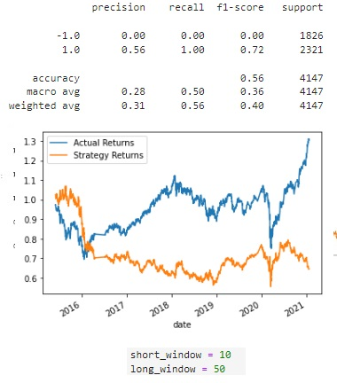

# Project Title: Machine Learning Trading Bot

The proejct will combine algorithmic trading with financial Python programming and machine learning to create an algorithmic trading bot that learns and adapts to new data and evolving markets including:

Implementing an algorithmic trading strategy that uses machine learning to automate the trade decisions.

Adjusting the input parameters to optimize the trading algorithm.

Training a new machine learning model and compare its performance to that of a baseline model.

---

## Technologies:

The project uses python 3.7 with the following packages:

* [pandas](https://pandas.pydata.org/) - For providing data analysis and manipulation tool built on top of the Python programming language

* [sklearn](https://scikit-learn.org/stable/) - Machine learning package in Python

* [tensorflow](https://www.tensorflow.org/) - end-to-end open source platform for machine learning

* [numpy](https://numpy.org/doc/stable/) - It is a fundamental package for scientific computing in Python

* [pathlib](https://docs.python.org/3/library/pathlib.html) - Offers classes representing filesystem paths with semantics appropriate for different operating systems

* [hvplot](https://hvplot.holoviz.org/) - Provides an alternative for the static plotting API provided by Pandas and other libraries

* [%matplotlib inline](https://pythonguides.com/what-is-matplotlib-inline/) -  enable the inline plotting, where the plots/graphs will be displayed just below the cell where your plotting commands are written


---

## Installation Guide


Before running the application first install the following dependencies:

```python
import pandas as pd
import numpy as np
from pathlib import Path
import hvplot.pandas
import matplotlib.pyplot as plt
from sklearn import svm
from sklearn.preprocessing import StandardScaler
from pandas.tseries.offsets import DateOffset
from sklearn.metrics import classification_report
```

---

## Usage

To run the program, simply clone the repository, and go through the written steps in the *.ipynb file.


Adjustments:

Step 1: Tune the training algorithm by adjusting the size of the training dataset.

Based on the higher recall for longer time period (1 year vs 1 month or 3 month), it seems that the 1 year time-period is better at predicting the 1 class than the −1 class.




Step 2: Tune the trading algorithm by adjusting the SMA input features

Better recall for 1 class if the short window is longer (10 SMA vs 4 SMA)




Step 3: Choose the set of parameters that best improved the trading algorithm returns

Changing to 10 SMA and 80 SMA for the short and long windows seems to recall class 1 better than 4 and 10 windows




---

## Contributors

Jung Kim


---

## License

MIT License
